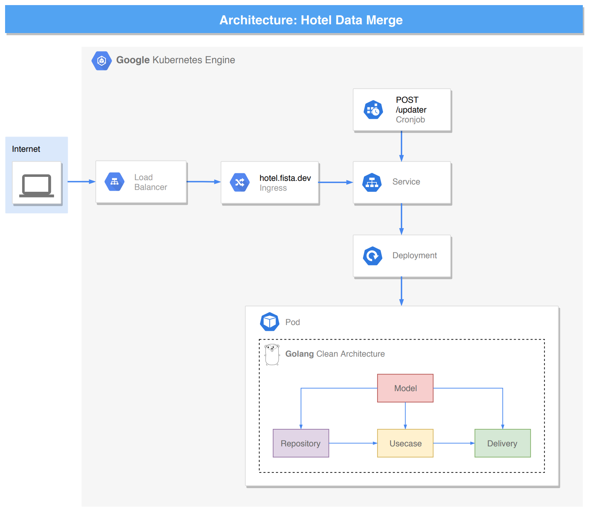

# Hotel Data Merge

## Introduction

This is an exercise, works as a web server, written by Golang. This exercise performs actions:
- Query multiple hotel supplier data to assimilate, sanitize and merge them
- Build an API endpoint which allows you to query the hotel's data, and hourly update data
- Create a deployment and continuous delivery pipeline by Github Actions

## Description

In this exercise, I implement Clean Architecture. Rule of Clean Architecture by Uncle Bob:
- **Independent of Frameworks.** The architecture does not depend on the existence of some library of feature laden software. This allows you to use such frameworks as tools, rather than having to cram your system into their limited constraints.
- **Testable.** The business rules can be tested without the UI, Database, Web Server, or any other external element.
- **Independent of UI.** The UI can change easily, without changing the rest of the system. A Web UI could be replaced with a console UI, for example, without changing the business rules.
- **Independent of Database.** You can swap out Oracle or SQL Server, for Mongo, BigTable, CouchDB, or something else. Your business rules are not bound to the database.
- **Independent of any external agency.** In fact your business rules simply don’t know anything at all about the outside world.

This project has 4 Layer:
- Models layer (Hotel model)
- Repository layer (Store hotel data as json file)
- Usecase layer (Business logic: query, sanitize, merge, ...)
- Delivery layer (REST API endpoint)

## Architecture Diagram
